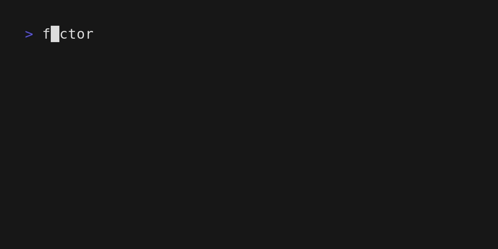

# `$ fe` - edit your flake inputs with ease
[](https://builtwithnix.org)
[](https://crates.io/crates/flake-edit)
[](https://docs.rs/flake-edit)
[](https://matrix.to/#/#flake-edit:matrix.org)

`$ fe` - **f**lake **e**dit - edit your flake inputs with ease.

## `$ fe` - usage

`fe` has the following cli interface:

`$ fe help`
```
Edit your flake inputs with ease

Usage: fe [OPTIONS] [FLAKE_REF] <COMMAND>

Commands:
  add
          Add a new flake reference
  pin
          Pin a specific flake reference based on its id
  change
          Change a specific flake reference based on its id
  remove
          Remove a specific flake reference based on its id
  list
          List flake inputs
  help
          Print this message or the help of the given subcommand(s)

Arguments:
  [FLAKE_REF]
          

Options:
      --flake <FLAKE>
          
      --health
          Checks for potential errors in the setup
      --ref-or-rev <REF_OR_REV>
          Pin to a specific ref_or_rev
  -h, --help
          Print help
  -V, --version
          Print version
```

### `$ fe add`
`$ fe help add`
```
Add a new flake reference

Usage: fe add [OPTIONS] [ID] [URI]

Arguments:
  [ID]
          The name of an input attribute
  [URI]
          The uri that should be added to the input

Options:
      --ref-or-rev <REF_OR_REV>
          
      --force <FORCE>
          Allow operations on uncommitted files
  -h, --help
          Print help
```
For some types, the id will be automatically inferred.


For some inputs, the uri can be put in directly and the id and type will be inferred.


### `$ fe remove`
`$ fe help remove`
```
Remove a specific flake reference based on its id

Usage: fe remove [ID]

Arguments:
  [ID]
          

Options:
  -h, --help
          Print help
```


### `$ fe list`
`$ fe help list`
```
List flake inputs

Usage: fe list [OPTIONS]

Options:
      --format <FORMAT>
          [default: simple]
  -h, --help
          Print help
```
List the outputs, that are specified inside the inputs attribute.

List the outputs, that are specified inside the inputs attribute, in json format.


## License
MIT
